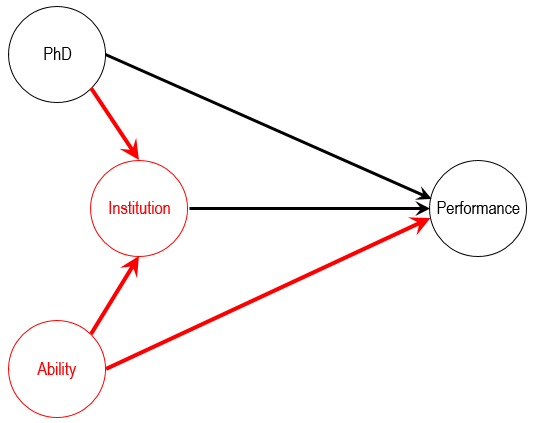

```{r setup, include=FALSE}
options(htmltools.dir.version = FALSE)
knitr::opts_chunk$set(eval = TRUE, echo = TRUE, warning = FALSE,
                      message = FALSE, cache = FALSE)

```

# What this paper does


- Constructs an impressive an original dataset:

  - Inflation and interest rate forecasts made by __480__ experts from __440__ institutions, before and after the global finance crisis.
  
  - A rich set of forecasters characteristics: experience (type and time), gender, education (level, type, and quality), and affiliation (type and place).
  
- Composes a measure of survival rate as well as three measures of forecasting performance - accuracy, courage, and instability.

- Characterizes the factors associated with forecaster survival rate and performance.


---

# What the paper finds

The following characteristics __improve__ forecasting performance, courage, and instability:

1. Level and quality of the education.

2. Localization and type of their affiliation.

3. Experience, as a forecaster in a central bank or academia.


---

# My Comments

1. [Literature](#lit)

2. [Economic Significance?](#sig)

3. [Causallity and Policy Implications](#causality)


---
class: title-slide-section-blue, center, middle
name: lit

# Comment #1: Literature


---

# From economics

[Cho and Hersch](https://www.sciencedirect.com/science/article/pii/S0148619597000520) (1998, JoEB):

- draw a panel data from _The Wall Street Journal_’s survey of economic forecasts.

- forecasts of interest rates, inflation, and GDP growth rate,
      
- find a _little_ effect of characteristics on accuracy.
    
- focus on forecast bias, experience, and institutional settings.


---

# From psychology

.pull-left[
```{r, echo=FALSE, out.width = "65%", fig.align='center'}


```
]
.pull-right[

According to Tetlock & Gardner, superforecasters typically have:

- Philosophic Outlook: Cautious, Humble, Non-deterministic.
- Thinking Style: Open-Minded, Intelligent and Curious, Reflective, Numerate.
- Forecasting Style: Pragmatic, Analytic, Dragonfly-Eyed, Probabilistic, Thoughtful Updaters, Intuitive Psychologist.
- Work Ethic: Growth Mindset, Grit.

]


---
class: title-slide-section-blue, center, middle
name: sig

# Comment #2: Economic Significance


---

# Economic significance

.pull-left[
__Table 2:__ Panel estimates for the US CPI expert forecasts
```{r, echo=FALSE, out.width = "120%", fig.align='center'}


```
]
.pull-right[

Note that

- $R^2$ quite low.

- $p$-values ("stars") are not informative about the economic relevance of the effect.


]

---

# Suggestion: Superforecasters vs. simple average

- Compile a "portfolio" of forecasters, where inclusion is based on characteristics shown to be associated with excellent performance.

- Run a horse-race between your portfolio and a benchmark (e.g., simple average)

- Test for differences in forecast accuracy (e.g., Diebold-Mariano)


---
class: title-slide-section-blue, center, middle
name: causality

# Comment #3: Causality and Policy Implications


---

# Econometric approach

In their main analysis, the authors use a two-way fixed effect panel data model to estimate the effects of various forecaster characteristics on forecasting performance:

$$y_{it}=x_{it}^{\prime} \beta+\alpha_{i}+\theta_{t}+\varepsilon_{it}$$

where $y_{it}$ is a measure of forecasting performance (accuracy, courage, and instability), and $x_i$ is a vector of forecaster characteristics.

> __RESEARCH QUESTION:__ Which forecasters characteristics __affect__ forecasting performance? 


---

# The curse of dimensionality

Presumably, the list of covariates is not sizable:
- experience
- locality
- gender
- degree level
- degree quality
- field
- institution type
- localization

However, attaching causal claims to each one of the above (as well as to interactions) is an ambitious task.

In particular, the inclusion or exclusion of covariates depends on the causal question want to answer.


---

# Example: Does having a PhD affect performance?

.pull-left[

Let's assume for simplicity that PhDs are randomly assigned.

In this case, estimating the effect of having a PhD on forecasting performance is straightforward: Regress performance onto a PhD dummy.

> __QUESTION:__ Shouldn't we adjust for institution type?

]
.pull-right[
```{r, echo=FALSE, out.width = "120%", fig.align='center'}


```
]


---

# Institution affiliation bias

.pull-left[

> __ANSWER:__ No.

Controlling for __`Institution`__ generates selection bias: it opens up a back-door path between __`Ability`__ and __`Performance`__.


In this example, the bias is probably _negative._ It seems reasonable to think that someone who gets into a financial institution without the benefit of a PhD probably has higher than average innate ability.

]
.pull-right[
```{r, echo=FALSE, out.width = "120%", fig.align='center'}



```
]


---

# What to do?

__OPTION 1:__ Try to focus on estimating the causal effect of a low-dimensional vector of characteristics (preferably one) and treat other covariates as potential controls.

- Challenge: What to focus on?

__OPTION 2:__ Look for other exogenous variation in the data and see how its effect varies with forecasters characteristics.

- e.g., Coibion and Gorodnichenko (JPE 2012).

__OPTION 3:__ Stay in the realm of descriptive studies, but refine the research question, e.g., 

- Is there evidence of superforecasters? If so, what are their characteristics?

- Do forecasters carry their performance level when they switch jobs?


---

# Switching jobs


Does switching jobs change outcomes? The case of football managers:

```{r, echo=FALSE, out.width = "60%", fig.align='center'}


```


---

# How special is "the special one"?

.pull-left[
```{r, echo=FALSE, out.width = "80%", fig.align='center'}


```


_Source_: [The Economist.](https://www.economist.com/graphic-detail/2019/01/19/managers-in-football-matter-much-less-than-most-fans-think)
]

.pull-right[
```{r, echo=FALSE, out.width = "90%", fig.align='center'}

knitr::include_graphics("figs/football_flow2.jpg")

```
]


---

# Miscellaneous comments

- Descriptive statistics: Average years of experience? How many have PhD? How many economists? How many women? Etc.

- Survival analysis: Is it relevant?

- Non-linearity in __`experience`__?

- Add figures!

- Missing data and imputations.


---

# Summary of comments and suggestions

- Great database!

- Interesting findings

- Refine causal analysis

---
class: .title-slide-final, center, inverse, middle

# `slides %>% end()`

[<i class="fa fa-github"></i> Source code](https://github.com/itamarcaspi/forecaster-performance-discussion)  

---

# References

Cho, D. W., & Hersch, P. L. (1998). [Forecaster characteristics and forecast outcomes](https://www.sciencedirect.com/science/article/pii/S0148619597000520). _Journal of Economics and Business_, 50(1), 39-48.

Coibion, O., & Gorodnichenko, Y. (2012). [What can survey forecasts tell us about information rigidities?](https://www.journals.uchicago.edu/doi/abs/10.1086/665662). _Journal of Political Economy_, 120(1), 116-159.

Tetlock, P. E., & Gardner, D. (2015). _Superforecasting: The Art and Science of Prediction_. New York: Crown/Archetype. Print.